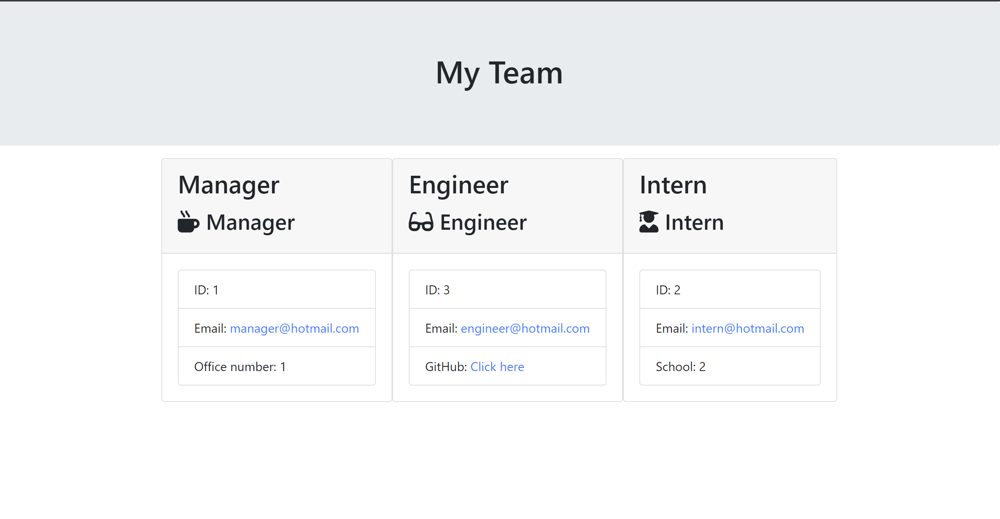

# Team-Profile-Generator

## Descritpion
This project is a team profile generator using Nodejs, and test driven development (Jest). The terminal prompts some questions to the user and depending on the user's answer an HTML page will be generated by the app. 

## Technologies
HTML, CSS, JS, Nodejs, Inquirerjs, OOP, and Jest

## Installation

Please follow the guidelines below in order to install the project on your local machine and test it out:

1. Clone or download the repository to your own local machine and run it from your terminal as Nodejs applications do not have GUI. 

2. Then, ensure that your repo includes a package.json with the required depencies such as jest and inquirer. 

3. Run node index.js in your terminal to luach the application, and the first question should appear in your terminal. 

4. To check Jest works, run npm run test and inspect what the terminal returns. 

5. Play around with it and see if you can add new features. 

# Link URL to Github Repository
https://github.com/SohailShirzad/Team-Profile-Generator

#Output
